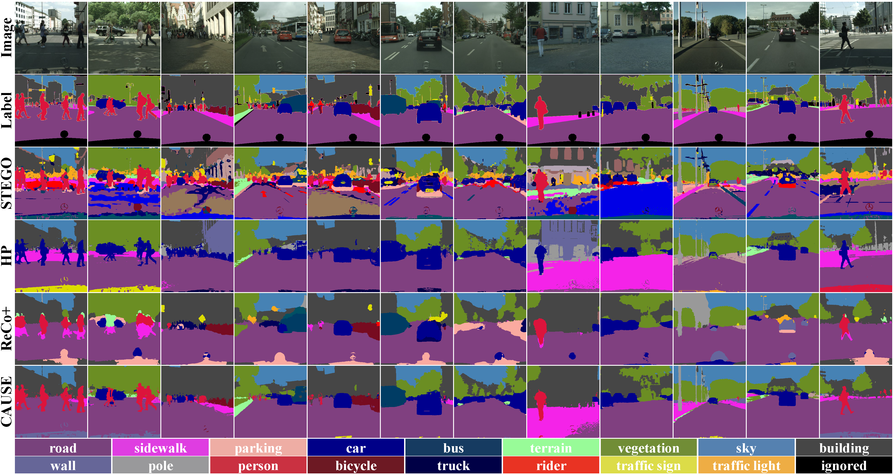

# ***Title: Causal Unsupervised Semantic Segmentation***

This is pytorch implementation code for realizing the technical part of *Causal Unsupervised Semantic Segmentation (CUSS)* to improve performance of unsupervised semantic segmentation.
This code is further developed by two baseline codes of [HP: Leveraging Hidden Positives for Unsupervised Semantic Segmentation](https://github.com/hynnsk/HP) accpeted in [CVPR 2023](https://openaccess.thecvf.com/content/CVPR2023/papers/Seong_Leveraging_Hidden_Positives_for_Unsupervised_Semantic_Segmentation_CVPR_2023_paper.pdf)
and [STEGO: Unsupervised Semantic Segmentation by Distilling Feature Correspondences](https://github.com/mhamilton723/STEGO) accepted in [ICLR 2022](https://iclr.cc/virtual/2022/poster/6068).


---

You can see the following bundle of images in Appendix.
Further, we explain concrete implementation beyond the description of the main paper.

<figure class="half">


<figure>


---

## Download Visual Quality and Checkpoints of CUSS (Under preparation for Sharable Link, The updated will be simultaneously completed within a few day!)

You can download the checkpoint files including CUSS-trained parameters based on
[DINO](https://openaccess.thecvf.com/content/ICCV2021/papers/Caron_Emerging_Properties_in_Self-Supervised_Vision_Transformers_ICCV_2021_paper.pdf), [DINOv2](https://arxiv.org/pdf/2304.07193.pdf), [MAE](https://openaccess.thecvf.com/content/CVPR2022/papers/He_Masked_Autoencoders_Are_Scalable_Vision_Learners_CVPR_2022_paper.pdf), [MoCov3](https://openaccess.thecvf.com/content/ICCV2021/papers/Chen_An_Empirical_Study_of_Training_Self-Supervised_Vision_Transformers_ICCV_2021_paper.pdf), [iBOT](https://openreview.net/pdf?id=ydopy-e6Dg), [Unicom](https://openreview.net/pdf?id=3YFDsSRSxB-), [MSN](https://www.ecva.net/papers/eccv_2022/papers_ECCV/papers/136910442.pdf)
in self-supervised vision transformer framework.
If you want to download the pretrained models of DINO in various structures the following CUSS uses,
you can download them in the following links:

* [DINO](https://github.com/facebookresearch/dino)
* [DINOv2](https://github.com/facebookresearch/dinov2)
* [MAE](https://github.com/facebookresearch/mae)
* [MoCov3](https://github.com/facebookresearch/moco-v3)
* [iBOT](https://github.com/bytedance/ibot)
* [Unicom](https://github.com/deepglint/unicom)
* [MSN](https://github.com/facebookresearch/msn)

---

|   Dataset    | Method        | Baseline   | mIoU(%) | pAcc(%) |  Visual Quality                                         |                                           Checkpoint                                           |
|:------------:|---------------|------------|:-------:|:-------:|:---------------------------------------------------------------------------------------------:|:----------------------------------------------------------------------------------------------:|
|  COCO-Stuff  | DINO+**CUSS** | ViT-S/8  |  26.4   |  65.3   |  [[link]]()   | [[link]]() |
|  COCO-Stuff  | DINO+**CUSS** | ViT-S/16 |  27.3   |  63.8   |  [[link]]()   | [[link]]() |
|  COCO-Stuff  | DINO+**CUSS** | ViT-B/8  |  31.4   |  69.1   |  [[link]]()   | [[link]]() | 
|  COCO-Stuff  | DINO+**CUSS** | ViT-B/16 |  28.8   |  67.4   |  [[link]]()   | [[link]]() |
|  COCO-Stuff  | DINOv2+**CUSS** | ViT-S/14 |  27.3   |  63.8   |  [[link]]()   | [[link]]() |
|  COCO-Stuff  | DINOv2+**CUSS** | ViT-B/14 |  28.8   |  67.4   |  [[link]]()   | [[link]]() |
|  COCO-Stuff  | MAE+**CUSS** | ViT-S/16 |  28.8   |  67.4   |  [[link]]()   | [[link]]() |
|  COCO-Stuff  | MAE+**CUSS** | ViT-B/16 |  28.8   |  67.4   |  [[link]]()   | [[link]]() |
|  COCO-Stuff  | MoCov3+**CUSS** | ViT-S/16 |  28.8   |  67.4   |  [[link]]()   | [[link]]() |
|  COCO-Stuff  | MoCov3+**CUSS** | ViT-B/16 |  28.8   |  67.4   |  [[link]]()   | [[link]]() |
|  COCO-Stuff  | iBOT+**CUSS** | ViT-S/16 |  28.8   |  67.4   |  [[link]]()   | [[link]]() |
|  COCO-Stuff  | iBOT+**CUSS** | ViT-B/16 |  28.8   |  67.4   |  [[link]]()   | [[link]]() |
|  COCO-Stuff  | Unicom+**CUSS** | ViT-B/16 |  28.8   |  67.4   |  [[link]]()   | [[link]]() |
|  COCO-Stuff  | MSN+**CUSS** | ViT-S/16 |  28.8   |  67.4   |  [[link]]()   | [[link]]() |
|  COCO-Stuff  | MSN+**CUSS** | ViT-B/16 |  28.8   |  67.4   |  [[link]]()   | [[link]]() |


---

|   Dataset    | Method        | Baseline   | mIoU(%) | pAcc(%) |  Visual Quality                                         |                                           Checkpoint                                           |
|:------------:|---------------|------------|:-------:|:-------:|:---------------------------------------------------------------------------------------------:|:----------------------------------------------------------------------------------------------:|
|  Cityscapes  | DINO+**CUSS** | ViT-S/8    |  20.4   |  85.3   | [[link]]()  | [[link]]() |
|  Cityscapes  | DINO+**CUSS** | ViT-S/16   |  15.4   |  77.4   | [[link]]()  | [[link]]() |
|  Cityscapes  | DINO+**CUSS** | ViT-B/8    |  23.0   |  86.9   | [[link]]()  | [[link]]() |
|  Cityscapes  | DINO+**CUSS** | ViT-B/16   |  17.3   |  80.3   | [[link]]()  | [[link]]() |
|  Cityscapes  | DINOv2+**CUSS** | ViT-S/14 |  27.3   |  63.8   |  [[link]]()   | [[link]]() |
|  Cityscapes  | DINOv2+**CUSS** | ViT-B/14 |  28.8   |  67.4   |  [[link]]()   | [[link]]() |
|  Cityscapes  | MAE+**CUSS** | ViT-S/16 |  28.8   |  67.4   |  [[link]]()   | [[link]]() |
|  Cityscapes  | MAE+**CUSS** | ViT-B/16 |  28.8   |  67.4   |  [[link]]()   | [[link]]() |
|  Cityscapes  | MoCov3+**CUSS** | ViT-S/16 |  28.8   |  67.4   |  [[link]]()   | [[link]]() |
|  Cityscapes  | MoCov3+**CUSS** | ViT-B/16 |  28.8   |  67.4   |  [[link]]()   | [[link]]() |
|  Cityscapes  | iBOT+**CUSS** | ViT-S/16 |  28.8   |  67.4   |  [[link]]()   | [[link]]() |
|  Cityscapes  | iBOT+**CUSS** | ViT-B/16 |  28.8   |  67.4   |  [[link]]()   | [[link]]() |
|  Cityscapes  | Unicom+**CUSS** | ViT-B/16 |  28.8   |  67.4   |  [[link]]()   | [[link]]() |
|  Cityscapes  | MSN+**CUSS** | ViT-S/16 |  28.8   |  67.4   |  [[link]]()   | [[link]]() |
|  Cityscapes  | MSN+**CUSS** | ViT-B/16 |  28.8   |  67.4   |  [[link]]()   | [[link]]() |


---

## CUSS Framework (Top-Level File Directory Layout) 
    .
    ├── loader
    │   ├── netloader.py                # Self-Supervised Pretrained Model Loader & Segmentation Head Loader
    │   └── stego_dataloader.py         # Dataloader Thanks to STEGO [ICLR 2022]
    │
    ├── models                          # Model Design of Self-Supervised Pretrained: [DINO/Moco-v3/MAE]
    │   ├── dinomaevit.py               # ViT Structure of DINO and MAE
    │   ├── dinov2vit.py                # ViT Structure of DINOv2
    │   └── mocov3vit.py                # ViT Structure of Moco-v3
    │
    ├── modules                         # Segmentation Head and Its Necessary Function
    │   └── segment.py                  # [CNN] Including Tools with Generating Concept Book and Contrastive Learning
    │   └── segment2.py                 # [DETR] Including Tools with Generating Concept Book and Contrastive Learning
    │
    ├── utils
    │   └── utils.py                    # Utility for auxiliary tools
    │
    ├── train_modularity.py             # (STEP 1) [CNN & DETR] Generating Concept Cluster Book as a Mediator
    │
    ├── train_front_door_cnn.py         # (STEP 2) [CNN] Frontdoor Adjustment through Unsupervised Semantic Segmentation
    ├── fine_tuning_cnn.py              # (STEP 3) [CNN] Fine-Tuning Cluster Probe
    │
    ├── train_front_door_detr.py        # (STEP 2) [DETR] Frontdoor Adjustment through Unsupervised Semantic Segmentation
    ├── fine_tuning_detr.py             # (STEP 3) [DETR] Fine-Tuning Cluster Probe
    │
    ├── test_cnn.py                     # [CNN] Evaluating Unsupervised Semantic Segmantation Performance (Post-Processing)
    ├── test_detr.py                    # [DETR] Evaluating Unsupervised Semantic Segmantation Performance (Post-Processing)
    │
    ├── requirements.txt
    └── README.md


---
## How to Run CUSS?


```shell bash
bash run # All of three steps integrated
```

In this shell script file, you can see the following code

```shell script
dataset="cityscapes" # cocostuff27 or cityscapes
train_gpu="0,1,2,3" # Only multi-gpu for DDP (if you want to run single gpu, then you will add "distributed" and set it to "False")
test_gpu="0" # Only singe gpu
ckpt="checkpoint/dino_vit_base_8.pth" # checkpoint root (/checkpoint) and its filename (name type is really important to run)
port="12302" # DDP port number

# CNN
python train_front_door.py --dataset $dataset --ckpt $ckpt --gpu $train_gpu --port $port && python fine_tuning.py --dataset $dataset --ckpt $ckpt --gpu $train_gpu --port $port && python test.py --dataset $dataset --ckpt $ckpt --gpu $test_gpu

# DETR
python train_front_door2.py --dataset $dataset --ckpt $ckpt --gpu $train_gpu --port $port && python fine_tuning2.py --dataset $dataset --ckpt $ckpt --gpu $train_gpu --port $port && python test2.py --dataset $dataset --ckpt $ckpt --gpu $test_gpu

# only test (if you want to only run test for evaluation, then you can uncomment it and run it)
# python test.py --dataset $dataset --ckpt $ckpt --gpu $test_gpu
# python test2.py --dataset $dataset --ckpt $ckpt --gpu $test_gpu
```


### 1. Training CUSS

### (STEP 1): Generating Mediator based on Modularity

```shell script
python train_mediator.py # DINO/DINOv2/MoCov3/MAE
```

### (STEP 2): Frontdoor Adjustment through Contrastive Learning

```shell script
python train_front_door.py # CNN
python train_front_door2.py # DETR
```


### (STEP 3):  *Technical STEP: Fine-Tuning Cluster Probe*

```shell script
python fine_tuning.py # CNN
python fine_tuning2.py # DETR
```

---

### 2. Testing CUSS

```shell script
python test.py # CNN
python test2.py # DETR
```

---


## Environment Settings

* Creating Virtual Environment by Anaconda
> conda create -y -n neurips python=3.9

* Installing [PyTorch]((https://pytorch.org/)) Package in Virtual Envrionment
> pip3 install torch torchvision torchaudio --index-url https://download.pytorch.org/whl/cu118

* Installing Pip Package
> pip install -r requirements.txt

* [Optional] Removing Conda and PIP Cache if Conda and PIP have been locked by unknown reasons
> conda clean -a && pip cache purge

---

## Download Datasets
### Available Datasets
* [COCO-Stuff](https://paperswithcode.com/dataset/coco-stuff)
* [Cityscapes](https://paperswithcode.com/dataset/cityscapes)

### Try the following scripts
> * wget https://marhamilresearch4.blob.core.windows.net/stego-public/pytorch_data/cityscapes.zip
> * wget https://marhamilresearch4.blob.core.windows.net/stego-public/pytorch_data/cocostuff.zip

### If the above do not work, then download [azcopy](https://learn.microsoft.com/en-us/azure/storage/common/storage-use-azcopy-v10?toc=%2Fazure%2Fstorage%2Fblobs%2Ftoc.json&bc=%2Fazure%2Fstorage%2Fblobs%2Fbreadcrumb%2Ftoc.json) and follow the below scripts
> * azcopy copy "https://marhamilresearch4.blob.core.windows.net/stego-public/pytorch_data/cityscapes.zip" "custom_path" --recursive
> * azcopy copy "https://marhamilresearch4.blob.core.windows.net/stego-public/pytorch_data/cocostuff.zip" "custom_path" --recursive


### Unzip Datasets

```shell script
unzip cocostuff.zip && unzip cityscapes.zip
```

---
